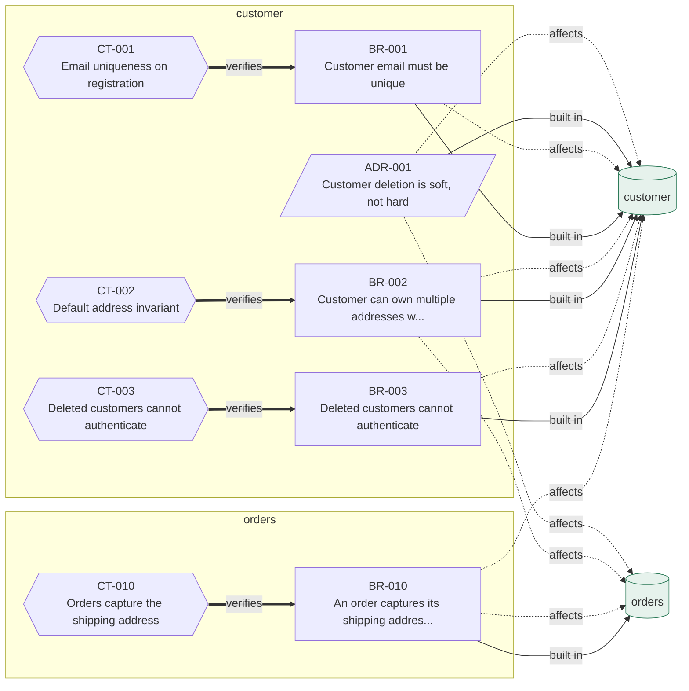

# Regen Engineering demo

Two implementations. One contract suite. Same knowledge.

This repository exists to make one claim checkable rather than rhetorical:

> Knowledge outlives the stack. The same knowledge regenerates into different
> languages, and one contract suite verifies all of them.

## Run it

Needs Node 18+ and Python 3.9+. No dependencies to install, on purpose.

```bash
node verify.mjs
```

```
============================================================
typescript  http://127.0.0.1:54123
============================================================
PASS  CT-001  Email uniqueness on registration  (4/4)
PASS  CT-002  Default address invariant  (6/6)
PASS  CT-003  Deleted customers cannot authenticate  (3/3)
PASS  CT-010  Orders capture the shipping address  (4/4)

17/17 scenarios passed across 4 contracts

============================================================
python  http://127.0.0.1:54126
============================================================
PASS  CT-001  Email uniqueness on registration  (4/4)
PASS  CT-002  Default address invariant  (6/6)
PASS  CT-003  Deleted customers cannot authenticate  (3/3)
PASS  CT-010  Orders capture the shipping address  (4/4)

17/17 scenarios passed across 4 contracts

PASS  typescript
PASS  python

Same knowledge. Same contracts. Different stacks. All green.
```

## Run the Regeneration Test yourself

The claim is only worth something if you can break it:

```bash
rm -rf impl/python
```

Then hand `customer/knowledge/`, `orders/knowledge/`, and `orders/knowledge/overview.md` to any capable coding agent and ask it to produce a Python implementation of that interface. Run `node verify.mjs` again.

If it comes back green, the knowledge was sufficient. If it does not, whatever the agent could not work out is your knowledge debt, itemised. That is the whole methodology in one command.

## The knowledge graph, drawn from its own links

Generated with `regen-graph` from the frontmatter links, not drawn by hand. A rule with no contract pointing at it would render outlined in red, which is the traceability metric made visible.



## What is where

```
customer/knowledge/     rules, decisions, contracts, overview
orders/knowledge/       rules, contracts, overview
knowledge/              vision, shared glossary
contracts/run.mjs       the runner: turns contract prose into HTTP calls
impl/typescript/        generated implementation, Node, no dependencies
impl/python/            generated implementation, stdlib only
verify.mjs              starts each implementation, runs the same suite
```

## Do the contracts assert anything?

```bash
node contracts/vacuity.mjs
```

Traceability counts contracts that *exist*. It cannot tell whether a contract would fail if the rule it claims to verify were violated, and this repository has already produced that failure: three of five new scenarios once passed against an implementation that ignored the rule entirely, while validation reported no problems.

The check is blunt. Run the suite against a straw implementation that answers every request with a plausible shape and no behaviour. Every scenario should fail; any that passes is asserting nothing. It found one on its first run: "authentication succeeds" was checking only for a 200, which a straw returns for everything, so it now asserts that the response identifies the customer who registered.

A contract nobody has seen fail is a contract nobody has tested.

## The part that matters

Look at [`contracts/run.mjs`](contracts/run.mjs) and notice what is missing from it: any mention of TypeScript or Python. It speaks only to the HTTP interface the knowledge describes.

That is not a coding style choice, it is the load-bearing constraint. A contract that reached inside an implementation, naming a class or a function, could not survive that implementation being regenerated in another language, and stack independence would be a slogan rather than a property.

Contracts live in the knowledge tree, are versioned as knowledge, and change only when a human deliberately changes them. Regenerated code must satisfy the contracts that existed **before** it was generated. Editing a contract to make a build pass is the one genuinely destructive move available in this methodology.

## Honest limits

**The contracts under-specify.** 17 scenarios do not prove these two implementations are equivalent, only that nothing contradicts what was specified. Either could carry a resource leak, a quadratic loop, or an injection flaw and still be green. Passing a contract suite is a floor, not a proof.

**This domain was chosen to be contract-friendly.** Business rules over an HTTP interface are the easy case, and honestly so. Interface feel, animation, and performance tuning against a specific runtime resist this treatment, which is why the manifesto puts them outside L3.

**Regeneration is not deterministic.** Two runs produce different code. The standard here is behavioural equivalence under contract, not textual reproduction.

## Validate the knowledge itself

```bash
npx -p regen-engineering-schema regen-validate .    # schema and graph
npx -p regen-engineering-schema regen-impact BR-002 # regeneration scope
npx -p regen-engineering-schema regen-debt .        # the five debt metrics
```

From [regen-engineering-schema](https://github.com/tysoncung/regen-engineering-schema).

## This demo is stateless, deliberately

Nothing here touches a database, which was an unexamined limit rather than a
simplification, and it hid the first question anyone asks about a real system.

[regen-engineering-stateful](https://github.com/tysoncung/regen-engineering-stateful)
is the reference for that, and it carries the result that came out of it: an
implementation that drops every table at startup passes all eighteen of its
ordinary contract scenarios and one of nine stateful ones.

## Licence

MIT for the code, CC BY-SA 4.0 for the knowledge and documentation.
